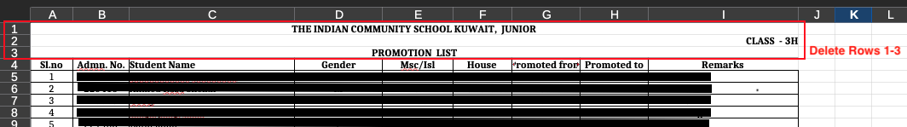
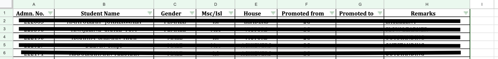
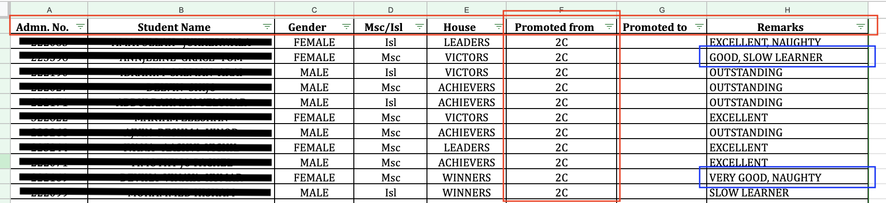
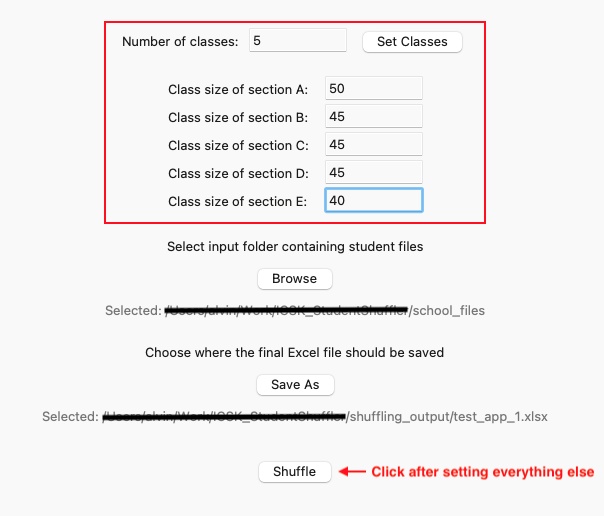

# Automating Student shuffling

This repository contains the codebase, format, requirements and release information for the student shuffling application.

## Support

- Windows 10 (64-bit)

- Windows 11 (64-bit)

## Format and Requirements

### Excel files

1. Store all Excel files in a single folder. When running the application, you will be prompted to select this folder.

2. Ensure that each Excel file begins with the column headers in the first row.
Delete any extra rows at the top containing text such as “ICSK Junior”, “Class 5A”, “Promotion List”, etc.
(Right-click the row number on the left and delete those rows.)

3. Ensure that each excel file contains the following columns with the same spelling and case. "Admn. No.", "Student Name", "Gender", "Msc/Isl", "House", "Performance", "Remarks".

**Note**: All Excel files must use the same column names.

4. Add two new columns, "Promoted from" and "Promoted to".
    
    `Promoted from`: Enter the current class for each student.
    
    `Promoted to`: Leave this column empty; it will be auto-populated by the program.

5. The Remarks column may contain descriptors such as “Naughty”, “Weak in studies”, “Slow learner” or “Scope for improvement”, separated by commas.
The program uses these remarks to distribute students evenly across classes based on behavior and performance.

### Running the application

1. Download `StudentShuffler-v1.0.0-win64.exe` from the Releases section, or directly from [here](https://github.com/AlvinManojAlex/ICSK_StudentShuffler/releases)

2. Double-click the application. (You might get a Windows warning, since the Publisher cannot be recognized. You can click "More info" and then click "Run anyway".)

3. You'll be met with a screen that will prompt you for "Number of classes". Enter the number of future classes

    (*Example*: If students from Class 2 are being promoted to Class 3, and Class 3 has 7 sections, enter 7.)

    Click the "Set Classes" button, then enter the maximum class strength for each section.

4. Click "Browse" button and choose the folder that contains the student excel files. (**Note**: Ensure that this folder only contains the relevant excel files and nothing else)

5. Click "Save As" button and choose the location and name of the final excel sheet.

6. Click "Shuffle" button to start the program.

